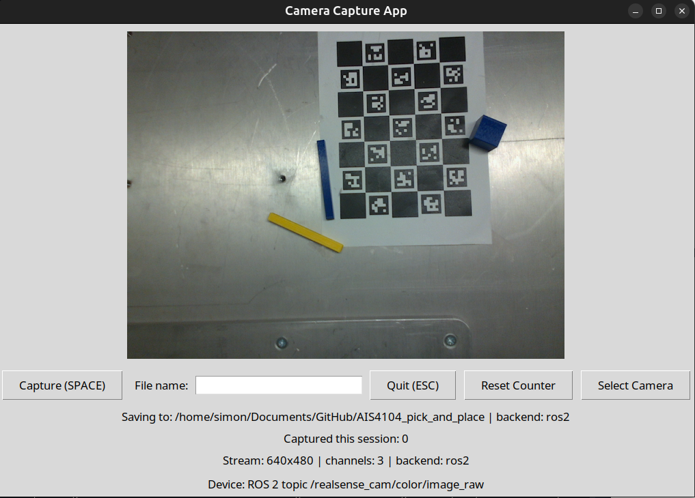

# RealSense L515 Camera App

This is a simple Python app for capturing training images. It was originally made for an Intel RealSense L515 camera, but it also works with other camera sources. It was made to speed up dataset collection for YOLO by allowing quick image capture, simple file naming, and more consistent results than a normal camera app.

## Supported camera sources

- Intel RealSense cameras through `pyrealsense2`
- Regular webcams and USB cameras through OpenCV, such as `/dev/video*` cameras on Linux
- ROS 2 image topics, when ROS 2 support is available

By default, the app tries to use a RealSense camera first and falls back to an OpenCV camera. You can also choose a source manually with the `Select Camera` button.

## ROS 2 image feeds

The app can subscribe to ROS 2 image topics.

Supported topic types:

- `sensor_msgs/msg/Image`
- `sensor_msgs/msg/CompressedImage`

ROS 2 support is optional. To use it, make sure you start the app from a shell where your ROS 2 environment is already sourced and `cv_bridge` is installed.

When ROS 2 is available, image topics appear in the `Select Camera` dialog.
